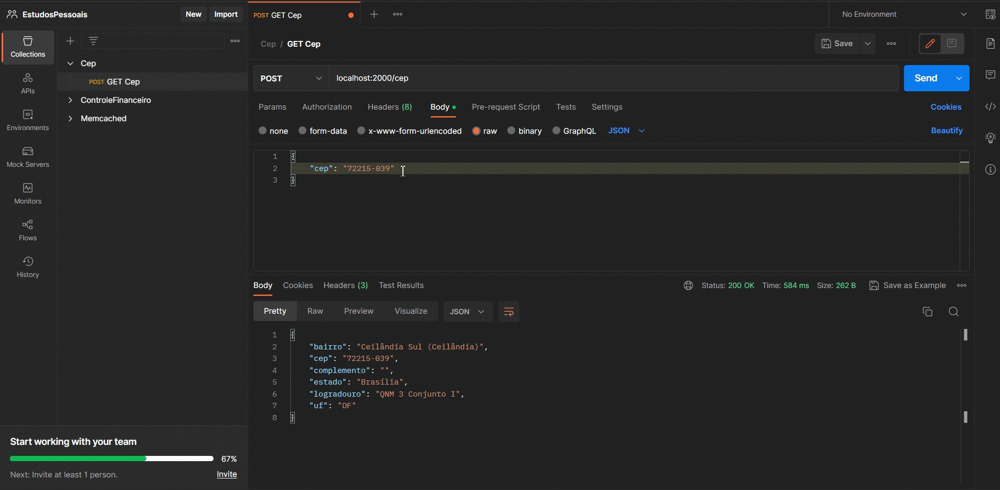

# API Busca de CEP

## Esta é uma API em Go que consome a API do Via CEP para retornar o endereço a partir do CEP fornecido no Postman. Além disso, a API também insere o endereço em um banco de dados PostgreSQL.

### Como usar

Para utilizar esta API, é necessário ter o Go e o PostgreSQL instalados em seu computador.

1. Clone o repositório para sua máquina.

2. Crie um banco de dados PostgreSQL e atualize as informações de conexão no arquivo database/database.go.

3. Execute o comando go get para instalar todas as dependências do projeto. 

4. Execute o comando go run main.go para iniciar o servidor.

5. Faça uma requisição POST para a URL http://localhost:2000/cep no Postman, passando o CEP no corpo da requisição em formato JSON.

6. O servidor retornará o endereço correspondente ao CEP fornecido e também o inserirá no banco de dados.

### Endpoints

#### POST /cep

Este endpoint recebe um objeto JSON contendo o CEP a ser buscado e retorna o endereço correspondente, além de inseri-lo no banco de dados. Se o CEP informado for inválido, o servidor retornará um erro.

Exemplo de requisição:

